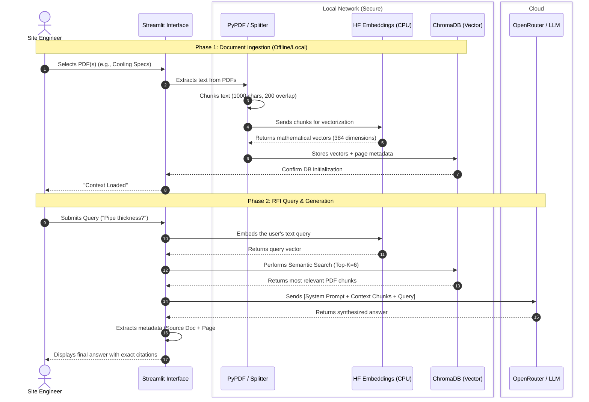

# Workflow A: RFI Context Engine (RAG Pipeline)

This document provides a detailed, component-level view of how the **Retrieval-Augmented Generation (RAG)** pipeline operates for the Request for Information (RFI) Context Engine. 

By running the embedding models locally and only sending retrieved snippets to the LLM, we ensure that our massive, proprietary construction blueprints and OSHA specifications never leak entirely to a third-party API.

## Architecture Diagram

## Technical Flow Breakdown

1. **Ingestion Layer:** When a user selects a document, `PyPDFLoader` strips the raw text. The `RecursiveCharacterTextSplitter` chops this massive text into overlapping chunks of 1000 characters so no context is lost at the boundaries.
2. **Local Embedding:** To save costs and maximize security, the chunks are converted into vector representations using a local HuggingFace model (`all-MiniLM-L6-v2`) running purely on the CPU.
3. **Vector Storage:** These vectors, alongside their original text and metadata (page numbers, document names), are stored in an in-memory `ChromaDB` instance.
4. **Retrieval & Synthesis:** When the engineer asks a question, the app embeds their question, compares it against the database, and pulls the top 6 most relevant chunks. The LLM then reads those specific chunks and synthesizes an accurate answer, forced by its System Prompt to cite its sources.
