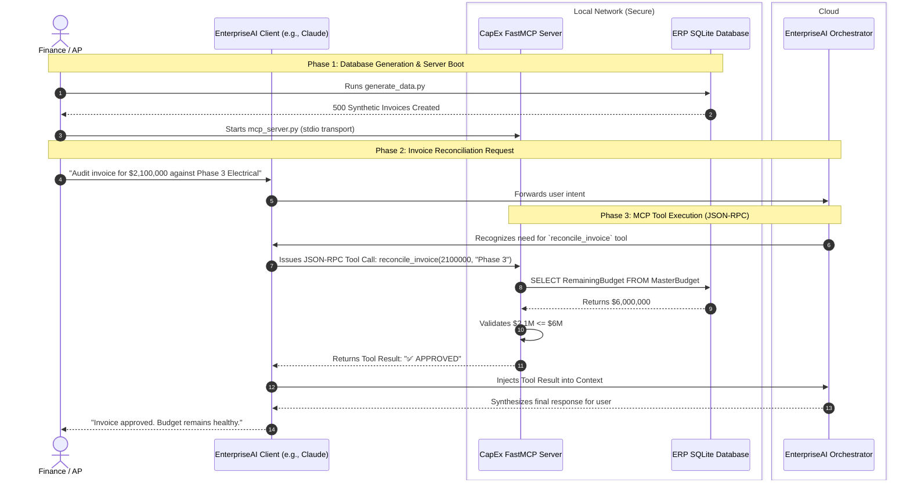

# Workflow B: CapEx Invoice Reconciliation Engine

This document details the **Model Context Protocol (MCP)** implementation for the Capital Expenditure (CapEx) Reconciliation Engine. 

By utilizing MCP, we connect the AI Orchestrator directly to our internal ERP database without giving the LLM direct, unsecured SQL execution rights. The AI is strictly provided with structured "Tools" it can call to fetch data, enforcing a "least privilege" security model.

## Architecture Diagram

## Technical Flow Breakdown

1. **Synthetic ERP Generation (`generate_data.py`):** For this simulation, we generate a highly realistic SQLite database (`capex_erp.db`) populated with a Master Budget and 500 randomized subcontractor invoices.
2. **The FastMCP Server (`mcp_server.py`):** This is the core of Workflow B. It spins up a local server utilizing the official Model Context Protocol. It exposes two strict python functions (`get_master_budget` and `reconcile_invoice`) as JSON-RPC tools.
3. **The Least Privilege Guardrail:** Notice that the LLM is *never* allowed to write `SELECT * FROM Invoices` or `DROP TABLE`. It only knows that a tool named `reconcile_invoice` exists. It passes the variables to the local server, the local server executes the hard-coded Python/SQL logic, and the local server returns the final string (Approved or Alert). This prevents SQL injection and LLM hallucination.
4. **Integration:** Because this uses the standardized MCP protocol, it can be instantly plugged into any MCP-compatible AI client (like Claude Desktop) by simply pointing the client to run the `mcp_server.py` file!
